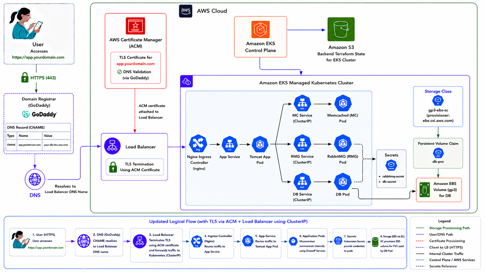
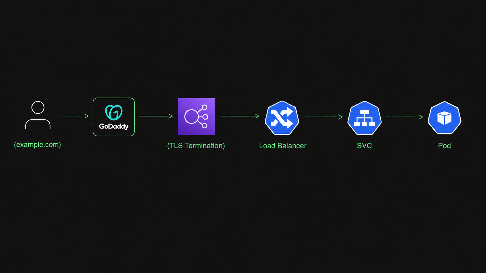

# **Deployment of Containerized Web Application (vprofile) on AWS EKS Cluster with AWS Load Balancer, DNS & TLS (Terraform Automated)**

## 📌 Overview

This project provisions a production-ready private Amazon EKS cluster using Infrastructure as Code (Terraform) and deploys a containerized Web Application using Kubernetes with:

- AWS Load Balancer Controller

- EKS Nginx Ingress 

- TLS termination using ACM

- DNS (Domain Name)

- Bastion host for secure access

The entire infrastructure layer is automated using Terraform.

## Architecture
Core AWS Services Used
- Amazon EC2
- Amazon EKS
- AWS Load Balancer (CLB or NLB)
- AWS IAM
- AWS Certificate Manager
- AWS S3 Bucket (backend terraform state)





## Infrastructure Provisioned with Terraform
### Networking (Custom VPC)
- VPC
- Public Subnets
- Private Subnets
- Internet Gateway (IGW)
- NAT Gateway
- Route Tables
- Security Groups

#### Architecture model:
```
Public Subnet:
  - Bastion Host
  - NAT Gateway
  - Load Balancer (CLB or NLB)

Private Subnet:
  - EKS Worker Nodes
```

### Private EKS Cluster
- Private Endpoint Enabled
- IAM Roles & Policies
- OIDC Provider
- IRSA (IAM Roles for Service Accounts)
- Managed Node Groups

#### Security-first design:
- No public access to worker nodes
- Access only via Bastion host

### Bastion Host
Used for:
- Secure SSH access
- Kubectl access to private cluster
- Helm installation
- Controller installation

# **Prerequisites Setup for This Repository (AWS CLI + Terraform via Chocolatey)**

Before running this EKS Terraform project, install the required tools on your system using Chocolatey.

# **1. Install Chocolatey (if not already installed)**

Open PowerShell as Administrator and install Chocolatey:
```shell

Set-ExecutionPolicy Bypass -Scope Process -Force; [System.Net.ServicePointManager]::SecurityProtocol = [System.Net.ServicePointManager]::SecurityProtocol -bor 3072; ` iex ((New-Object System.Net.WebClient).DownloadString('https://community.chocolatey.org/install.ps1'))

```

Verify installation:

```shell
choco -v
```

# **2. Install AWS CLI using Chocolatey**

Install AWS CLI:
```shell
choco install awscli -y
```
Verify:
```shell
aws --version
```
# **3. Install Terraform using Chocolatey**

Install Terraform:
```shell
choco install terraform -y
```
Verify:
```shell
terraform -version
```
# **EKS Project Run Steps (Terraform)**

## **1.Clone the repository to local: create a empty directory in local .Then clone it**

or 
### **In vs code-->click on terminal-->new terminal-->select git bash-->change to local directory --> run git clone command-->after cloning finished--->click on file-->open Folder-->select your cloned repository**
```shell
git clone https://github.com/RupaEnggVille/vprofile-eks.git

cd vprofile-eks
```
## **2. Go to Terraform working directory**

Based on instructions:
```shell
ls
cd terraform
ls
cd eks
```
Make sure this folder contains: main.tf, eks.tf, vpc.tf, provider.tf, backend.tf (for storing terraform state if required), dev.tfvars

## **3. Configure AWS CLI (mandatory):** 
Navigate to AWS console create an IAM user (eks-user) with adminstrator access for this project. Create access keys for that user & save access key and secret keys locally.
```shell
aws configure

Set:

AWS Access Key : give your access key
Secret Key  : give your secret key
Region → us-east-1
Output format → json
```
## **4. Create S3 backend bucket (if not already created)**

Through aws console or through command
```shell
aws s3 mb s3://your-terraform-state-bucket --region us-east-1
```

in **backend.tf** change the bucket name 

bucket       = "backend-bucket-final-6526"   #create s3 bucket through aws console and replace bucket name here

Update the region based on your AWS region in backend block. 


### In dev.tfvars 

Change Ami id of Ubuntu Server Based on region

ami_id        = "ami-091138d0f0d41ff90"  #replace with your ubuntu ami id based on region

Instance type based on your project size

instance_type = "t3.medium"  #change instance type

aws_region    = "us-east-1"   #change region

Cluster Node Capacity (Min, Max & desired)

Key-pair Name = One you created in AWS Console or Imported to AWS Console which is created locally.

if reguired change 

kubernetes_version        = "1.34" also


## **5. Create EC2 Key Pair (VERY IMPORTANT)**

Check in ec2.tf file which block you are using for key pair

**If you use data block:**

data "aws_key_pair"

So key MUST already exist in AWS.**(create manually through aws console)**

**If you use resource block:**

resource "aws_key_pair"

Generate through ssh-keygen

### Step 1: Create local key
```shell
ssh-keygen -t rsa -b 4096 -f ~/.ssh/ec2_keypair
```
### Step 2: Import into AWS
```shell
aws ec2 import-key-pair \
  --key-name ec2_keypair \
  --public-key-material fileb://~/.ssh/ec2_keypair.pub \
  --region us-east-1
```  
### Step 3: Verify
```shell
aws ec2 describe-key-pairs --key-names ec2_keypair
```  
## **6. Initialize Terraform**
```shell
terraform init
```  
This will: download AWS provider ,initialize backend (S3) ,prepare modules & other plugins required for the project.

## **7. Validate configuration**
```shell
terraform validate
```
## **8. Plan infrastructure**
```shell
terraform plan -var-file="dev.tfvars"    
```
We use dev.tfvars with terraform plan so Terraform already know all values. If we don’t use it, Terraform will stop and ask us to enter them one by one. 
Because, all global configuration settings are defined in dev.tfvars. If you run only terraform plan, it will prompt you to enter values manually.”

## **9. Apply infrastructure**
```shell
terraform apply -var-file="dev.tfvars"

Type:yes
```
After resource creation completes, verify in the AWS Console that the bastion server, cluster, and VPC ,IAM Roles are available. The process usually takes 10–15 minutes. Then copy the bastion server’s public IP address and launch a new Git Bash session.

## **10. Post Provisioning (Bastion Access & Kubernetes Setup)**

Connect to EKS Cluster Via Bastion because cluster is private.

**Prerequisites for Secure Access to cluster from Bastion:**
Before starting, ensure the following are installed and configured:
- Kubernetes Cluster (Amazon EKS)
- kubectl
- Helm
- eksctl
- AWS CLI
- IAM permissions for EKS and ELB creation

### **Step:1 SSH into Baston server **
```shell
ssh -i Downloads/key_pair.pem ubuntu@bastion_public_ip
```

(example: ssh -i Downloads/test-key.pem ubuntu@(bastion_public_ip))

### **Step:2 Configure AWS access**
```shell
aws configure    #enter here access keys and secret keys ,region and output format

AWS Access Key : give your saved access key

Secret Key  : give your saved secret key

Region → us-east-1 #change region

Output → json 
```

### **Step:3 Configure Kubernetes Access (EKS)**

Update kube Config file of EKS cluster to access it from Bastion (Replace region, cluster name)
```shell
aws eks update-kubeconfig --region us-east-1 --name dev-eks-demo
```

### **Step:4 Verify EKS Cluster Access:**
```shell
kubectl get nodes
```

## **11. Install Network Load Balancer Controller (nginx ingress controller)**

### **Step:1 Install Nginx ingress controller**
```shell
kubectl apply -f https://raw.githubusercontent.com/kubernetes/ingress-nginx/controller-v1.1.3/deploy/static/provider/aws/deploy.yaml
```
This command installs the NGINX Ingress Controller and creates an AWS Elastic Load Balancer (ELB) in Console.
AWS will provision an ELB (Network Load Balancer) automatically.

**If the created Load Balancer is not an internet facing then annotate the controller service with the following command**
```shell
kubectl annotate svc ingress-nginx-controller -n ingress-nginx service.beta.kubernetes.io/aws-load-balancer-scheme=internet-facing --overwrite
```

### **Step:2 Verify Installation**
```shell
kubectl get ns
kubectl get svc -n ingress-nginx
kubectl get pods --namespace ingress-nginx
kubectl get pods -n kube-system | grep ebs
```

## **12. Clone your repository to Bastion Server for Application Deployment**
```shell
git clone https://github.com/RupaEnggVille/vprofile-eks.git
ls
cd vprofile-eks/
ls
cd manifests/
ls
```
This folder contains manifest files to create pvc, ingress, secrets, deployments, services (frontend & backend).

## **13. Deploy Microservice Appication**
```shell
kubectl apply -f .
#apply all files except nginx-nlb-ingress.yaml (or) apply one by one 

Kubectl apply -f dbpvc.yaml
Kubectl apply -f db.yaml
Kubectl apply -f app.yaml
Kubectl apply -f mc.yaml
Kubectl apply -f rmq.yaml
Kubectl apply -f secret.yaml
Kubectl apply -f ingress.yaml
```

## **14. Verify:**
```shell
kubectl get pods
kubectl get deploy
kubectl get svc
kubectl get pvc
kubectl get sc
kubectl get ingress
kubectl describe ingress
kubectl describe ingress vpro-ingress
```
## **15. Add CNAME Record in GoDaddy**

Login to your godaddy account --> Domain -->DNS ---> Add New Record -->

Type: CNAME 

Name : vprofile #(Replace with the subdomain mentioned in ingress.yaml)

Value: DNS name of the load balancer created by ingress controller

## **16. Verify**

Wait for some time after creating DNS Record in GoDaddy

### **Verify in Browser:**

Check with the DNS name of the Load Balancer, you will get 404 for nginx controller. 

Ingress Controller will only forward request to the hostname mapped in the domain registrar. Application cannot be accessed using Load Balancer endpoint, can be accessed only with the hostname.

**http://vprofile.enggville.xyz**

Login and check the user list, click on any user the data will be inserted into cache. Go back and click on the user again, the data will be from cache.

### **Verify from Bastion (For Debugging)**
```shell
nslookup vprofile.enggville.xyz
dig vprofile.enggville.xyz
curl http://vprofile.enggville.xyz
curl -H "Host: vprofile.enggville.xyz" http://AWS-LB-DNS-Name      #Replace with your LB DNS Name
```

## **17. HTTPS Setup** (ACM + GoDaddy)  Enable TLS (HTTPS Setup)
 
### **step 1: Request an acm certificate in aws console**

choose Request a public certificate  --> click on next --> Fully qualified domain name : your godaddy domainname (*.enggville.xyz)

click on request

Certificate Status --> pending validation

### **step 2: Add DNS in GoDaddy**

Open godaddy.com  --> Domain -->DNS  ---> Add New Record  -->

Type: CNAME 

Name : Copy CNAME Name upto before .enggville.xyz (.domainname)  from aws console --->Paste it here

value: Copy CNAME value from aws console (completly)  -->paste it here

After completing the above steps, the certificate status in the AWS Console changes from Pending to Issued.

## **18. Enable HTTPS Ingress**

### **Step:1 Add SSL annotations to NGINX Service**
For adding SSL annotations & exposing HTTPS port for nginx service apply "nginx-nlb-ingress.yaml" file.
```shell
kubectl apply -f nginx-nlb-ingress.yaml
```
Note: targetPort should be http or 80 but not TCP.

NLB terminates SSL and forwards plain HTTP to NGINX.

### **Step:2 Configure Ingress for SSL Redirect**
```shell
vim ingress.yaml
```
**Uncomment the following line under annotations**
```shell
nginx.ingress.kubernetes.io/ssl-redirect: "true"
```
**comment the following line under annotations if facing issue with SSL redirect**
```shell
nginx.ingress.kubernetes.io/use-regex: "true"
```
**save the file  (:wq!) & apply ingress**
```shell
kubectl apply -f ingress.yaml
```
This automatically redirects:

http://vprofile.enggville.xyz
→
https://vprofile.enggville.xyz

### **Verify HTTPS:**
Wait for some time for propagating the changes and check in browser with domain name.

https://vprofile.enggville.xyz

You can access the vprofile application with TLS.

## **Process of Deletion:**

### **Step-1: Uninstall Ingress & delete ingress Namespace**
```shell
kubectl delete -f https://raw.githubusercontent.com/kubernetes/ingress-nginx/controller-v1.1.3/deploy/static/provider/aws/deploy.yaml
```
This command will uninstall & delete the ingress controller and also delete ingress-nginx namespace.

### **Verify**
```shell
kubectl get all -n ingress-nginx
kubectl get svc -A
```
AWS Load Balancer will be deleted

### **Step-2: Delete all resources created from manifests**
```shell
cd vprofile-eks/manifests/
kubectl delete -f .
```

### **Step-3: Delete Infrasture using Terraform** (In VS Code from Git Bash)
```shell
terraform destroy -var-file="dev.tfvars"

Type:yes
```
This command deletes the entire infrasture that is created by terraform.

### **Step-4: Delete the CNAME Record**

In GoDaddy --> DNS --> Select the CNAME Record created earlier --> Delete --> Confirm


# **Try with Classic Load Balancer For Practice**

## **Install Classic Load Balancer Controller using Helm (nginx ingress controller)**

## **1. Install Helm (inside bastion)**
```shell
curl -fsSL -o get_helm.sh https://raw.githubusercontent.com/helm/helm/main/scripts/get-helm-3
chmod 700 get_helm.sh
./get_helm.sh
```

## **2. NGINX Ingress Controller Setup on Amazon EKS (inside bastion)**
Install an Internet-facing NGINX Ingress Controller on an Amazon EKS cluster using Helm & expose applications using Kubernetes Ingress resources.

### **Step-1 Add Helm Repository**
```shell
helm repo add ingress-nginx https://kubernetes.github.io/ingress-nginx
```
Adds the official NGINX Ingress Helm chart repository to Helm.

### **Step-2 Update Helm Repositories**
```shell
helm repo update
```
Fetches the latest chart information from configured Helm repositories.

### **Step-3 Install Internet-Facing NGINX Ingress Controller**
```shell
helm upgrade --install ingress-nginx ingress-nginx/ingress-nginx \
  --namespace ingress-nginx \
  --create-namespace \
  --set controller.service.annotations."service\.beta\.kubernetes\.io/aws-load-balancer-scheme"="internet-facing" \
  --set controller.service.type=LoadBalancer
```
This command installs the NGINX Ingress Controller and creates an AWS Elastic Load Balancer (ELB) in Console.
AWS will provision an Elastic Load Balancer (CLB) automatically.

### **Step-4 Verify Installation**
```shell
kubectl get ns
kubectl get svc -n ingress-nginx
kubectl get pods --namespace ingress-nginx
kubectl get pods -n kube-system | grep ebs
```

## **3. Clone your repository to Bastion Server for Application Deployment**
```shell
git clone https://github.com/RupaEnggVille/vprofile-eks.git
ls
cd vprofile-eks/
ls
cd manifests/
ls
```
This folder contains manifest files to create pvc, ingress, secrets, deployments, services (frontend & backend).

## **4. Deploy Microservice Appication**
```shell
kubectl apply -f .
#apply all at once (or) apply one by one

Kubectl apply -f dbpvc.yaml
Kubectl apply -f db.yaml
Kubectl apply -f app.yaml
Kubectl apply -f mc.yaml
Kubectl apply -f rmq.yaml
Kubectl apply -f secret.yaml
Kubectl apply -f ingress.yaml
```

### **Verify:**
```shell
kubectl get pods
kubectl get deploy
kubectl get svc
kubectl get pvc
kubectl get sc
kubectl get ingress
kubectl describe ingress
kubectl describe ingress vpro-ingress
```
## **5. Add CNAME Record in GoDaddy**

Login to your godaddy account --> Domain -->DNS ---> Add New Record -->

Type: CNAME 

Name : vprofile #(Replace with the subdomain mentioned in ingress.yaml)

Value: DNS name of the load balancer created by ingress controller

## **6. Verify**

Wait for some time after creating DNS Record in GoDaddy

### **Verify in Browser:**

Check with the DNS name of the Load Balancer, you will get 404 for nginx controller. 

Ingress Controller will only forward request to the hostname mapped in the domain registrar. Application cannot be accessed using Load Balancer endpoint, can be accessed only with the hostname.

**http://vprofile.enggville.xyz**

Login and check the user list, click on any user the data will be inserted into cache. Go back and click on the user again, the data will be from cache.

### **Verify from Bastion (For Debugging)**
```shell
nslookup vprofile.enggville.xyz
dig vprofile.enggville.xyz
curl http://vprofile.enggville.xyz
curl -H "Host: vprofile.enggville.xyz" http://AWS-LB-DNS-Name      #Replace with your LB DNS Name
```
## **Process of deletion**
### **Step-1: Uninstall Ingress & delete ingress Namespace**
```shell
helm uninstall ingress-nginx -n ingress-nginx
kubectl delete namespace ingress-nginx

#verify deletion

kubectl get all -n ingress-nginx
kubectl get svc -A
```
AWS Load Balancer will be deleted

### **Step-2: Delete all resources created from manifests**
```shell
cd vprofile-eks/manifests/
kubectl delete -f .
```

### **Step-3: Delete Infrasture using Terraform** (In VS Code from Git Bash)
```shell
terraform destroy -var-file="dev.tfvars"

Type:yes
```
This command deletes the entire infrasture that is created by terraform.

### **Step-4: Delete the CNAME Record**

In GoDaddy --> DNS --> Select the CNAME Record created earlier --> Delete --> Confirm
   
